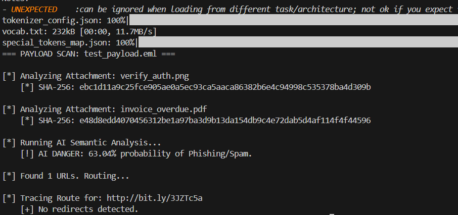

# 🛡️ Advanced Phishing & Email Security Analyzer

An automated, modular incident response pipeline designed to accelerate the triage of suspicious emails. This tool performs both dynamic infrastructure validation and deep static payload analysis to identify sophisticated phishing attempts, domain spoofing, and malicious indicators of compromise (IOCs).

 

## 🚀 Overview

Modern threat actors utilize complex obfuscation techniques to bypass standard secure email gateways (SEGs). This tool acts as an automated triage assistant for SOC Analysts, utilizing a multi-layered approach to dissect `.eml` files and validate domain reputation. 

### Core Capabilities:
* **Infrastructure Validation:** Queries DNS records to validate SPF and DMARC configurations, checks SSL certificate health, and cross-references Mail Exchange (MX) IPs against the Spamhaus DNSBL.
* **Semantic AI Analysis:** Leverages a lightweight Hugging Face NLP model (BERT) to analyze email body text and assign a probability score for social engineering or phishing intent.
* **Quishing (QR Phishing) Detection:** Extracts image attachments and scans them for hidden QR codes, extracting the embedded URLs for threat intelligence routing.
* **VBA Macro Extraction:** Hashes attachments and utilizes `oletools` to programmatically extract and flag malicious execution commands (e.g., PowerShell, Shell) hidden inside Office documents (`.docm`, `.xlsm`).
* **Deep Link Routing:** Unmasks shortened URLs by safely tracking HTTP redirect hops to their final destination.

## 📁 Modular Architecture

The project is built using a Separation of Concerns (SoC) design pattern for high extensibility:
* `/core`: Handles external infrastructure queries (DNS, SSL, Blacklists).
* `/payloads`: Manages file extraction, hashing, QR decoding, and link unmasking.
* `/ai`: Houses the machine learning semantic classification models.

## 🛠️ Installation & Setup

**Prerequisites:** Python 3.8+

